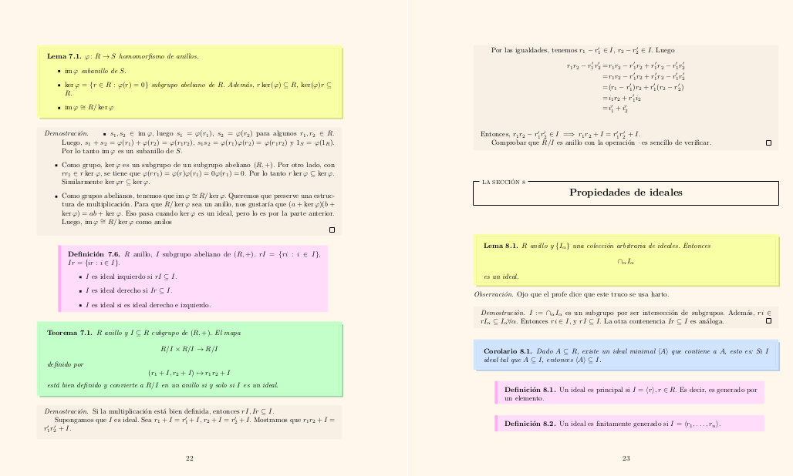

# Koolors

Este paquete tiene los diseños de los apuntes de LaTeX. Tiene formato para secciones, subsecciones, y formato para teoremas y enunciados.

### Dependencias

Para que se pueda cambiar el formato, es necesario el paquete `mdframed`.

## colores.py

Además, viene un archivo `colores.py` que permite cambiar la paleta de colores a partir de un color de acento.

### Dependencias

El archivo solo requiere el paquete [colorutils](https://github.com/edaniszewski/colorutils)

Para usarlo, dentro de la misma carpeta de `colores.sty` y `koolors.sty`, ejecutar el archivo con el formato `python3 colores.py "{#color_en_formato_hex}"`.

Se generarán cinco colores similares al input.

Es posible cambiar la variedad de colores modificando la constante `ANGLE` en el archivo `colores.py`.

